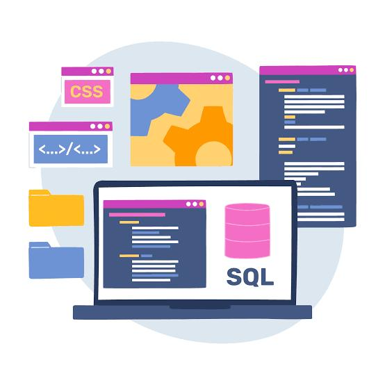
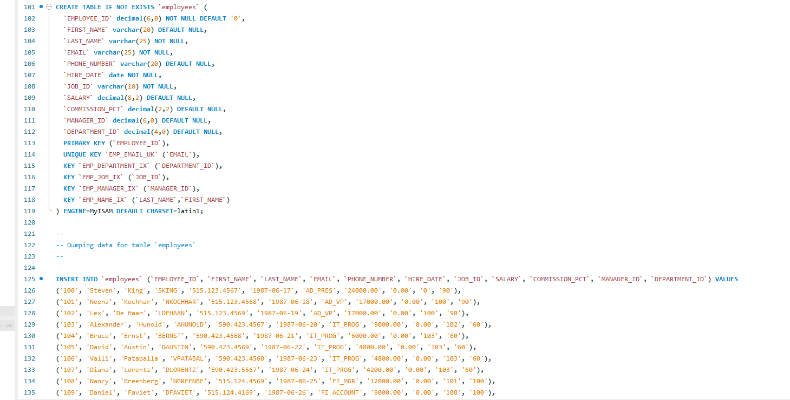
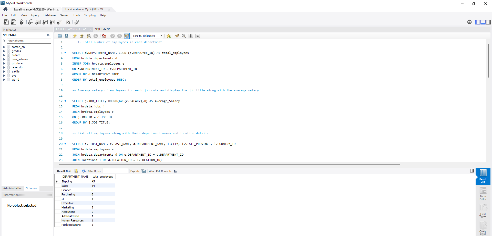

# Employee Insight for Hr Database

## Business Context
This is a multinational corporation. The management wants to gain insights into its employees, departments, job history, salaries and locations.

## Objective of the analysis
Analyze the data to extract meaningful insights from the HR database using MySQL.
 
## Data Overview
The HR database contains information about employees, their roles, departments, salaries, and locations.

## Key Findings
- Some departments employ significantly more staff than others. While a few departments may have only one or no employees, indicating underutilization or structural issues.
- Certain roles like senior executives or technical specialists earn well above average, while entry-level or support roles earn considerably less.
- Several employees have been with the company for over 5 years, indicating good employee retention in some areas. These long-term employees are likely valuable assets with institutional knowledge.

## MySql Report

## Recommendations
- Perform job evaluations and benchmarking to ensure fair compensation practices across similar job titles and departments.
- Leverage insights about long-term employees to develop mentorship programs and reduce turnover.
- Ensure no manager is overloaded or underutilized by reviewing direct reports.
- Optimize office locations and remote work policies based on location data and employee concentration.

## Conclusion
This HR data analysis reveals insightful trends in workforce structure, compensation, tenure, and departmental efficiency. These findings can help drive strategic HR planning, budget optimization, and talent management efforts. Implementing the recommendations above will improve operational efficiency, support employee engagement, and strengthen overall organizational health.

## Tools Used
MySQL Workbench
